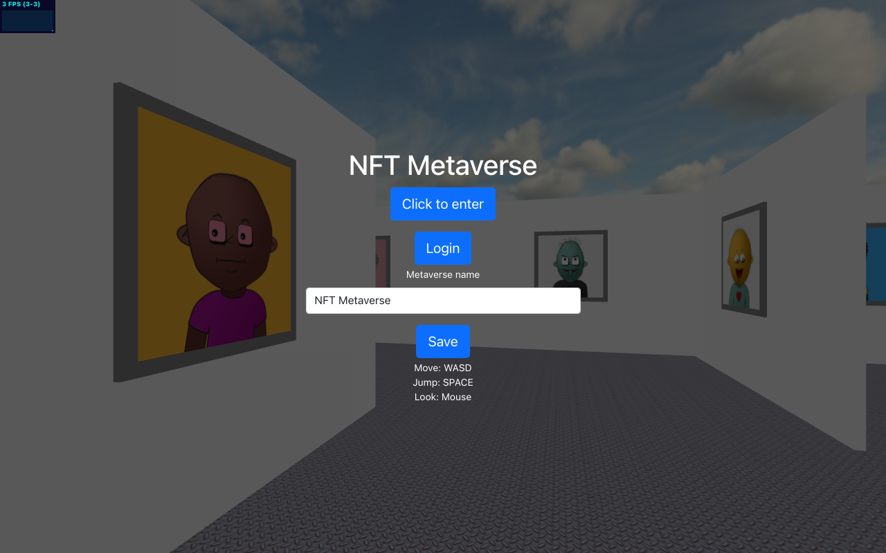

NFT Metaverse - BuildQuest hackathon 2022
===

NFT Metaverse is a immersive virtual world where user can meet, socialize and play games. 
NFTs play an important role for personalizing the user experience and as a foundation of games / virtual economies inside the metaverse.
The NFT metaverse combines existing NFT art owned by the user and combines it with a generative algorithm to produce a virtual world where the user can move around.

**[Live Demo](https://nft-metaverse-coral.vercel.app/)**

Project Scope
===

For this proof of concept these parts were implemented:

Graphics
---
- World generation using a maze algorithm
- 3d rendering of the walls and NFTs with image frames
- skybox and floor rendering

Web3
---
- Save state (player position, name of metaverse, NFT images) in IPFS
- Restore state from IPFS to make the metaverse shareable
- Web3 login using Moralis API / Metamask
- Fetching of NFT metadata using Moralis API and NFTLand API

Demo Deployment
---
- Demo is hosted on Vercel

Technology / Implementation
---
This project is developed in Typescript, it is purely client side. It connects to different Web3 APIs to gather data and present it to the user.
Rendering is based on WebGL using the Three.js library.

- [Typescript](https://www.typescriptlang.org/)
- [Vite](https://vitejs.dev/)
- [Three.js](https://threejs.org/e)
- Web3 APIs 

References
---
Three JS Pointerlock demo:
- https://threejs.org/examples/#misc_controls_pointerlock

Artwork:
- https://www.tilingtextures.com/
- https://polyhaven.com/